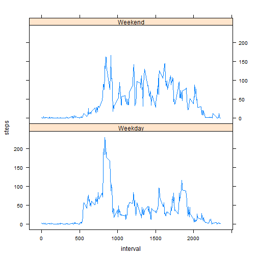

#First add the data

```r
activity <- read.csv("C:/Users/jgomezd/Documentos/repdata_data_activity/activity.csv")
activity$date<-as.Date(activity$date, "%Y-%m-%d")
#Remove na
activity2<- na.omit(activity)
```

#Mean total number of steps

```r
total<-rowsum(activity$steps, format(activity$date, "%Y-%m-%d"), na.rm = T)
hist(total)
```

 

```r
mean<- mean(total)
mean
```

```
## [1] 9354.23
```

```r
median<- median(total)
median
```

```
## [1] 10395
```

#Average daily activity pattern

```r
average<- tapply(activity$steps, activity$interval, mean, na.rm = TRUE)
plot(row.names(average), average, type="l")
```

 

```r
max<- which.max(average)
names(max)
```

```
## [1] "835"
```

#Missing values

```r
na<-sum(is.na(activity))
na
```

```
## [1] 2304
```

```r
StepsAverage <- aggregate(steps ~ interval, data = activity, FUN = "mean")
fillNA <- numeric()
for (i in 1:nrow(activity)) {
    obs <- activity[i, ]
    if (is.na(obs$steps)) {
        steps <- subset(StepsAverage, interval == obs$interval)$steps
    } else {
        steps <- obs$steps
    }
    fillNA <- c(fillNA, steps)
}

activity3<- activity
activity3$steps <- fillNA

total1<- (rowsum(activity3$steps, format(activity$date, "%Y-%m-%d"), na.rm = T))
hist(total1)
```

 

```r
mean1<- mean(total1)
mean1
```

```
## [1] 10766.19
```

```r
median2<- median(total1)
median2
```

```
## [1] 10766.19
```

Do these values differ from the estimates from the first part of the assignment? 
Yes

What is the impact of imputing missing data on the estimates of the total daily number of steps?
Equaling the values to the median and normal distribution.

#Weekdays vs weekends

```r
day<- weekdays(activity3$date)
str(day)
```

```
##  chr [1:17568] "Montag" "Montag" "Montag" "Montag" "Montag" ...
```

```r
daylevel <- vector()
for (i in 1:nrow(activity3)) {
    if (day[i] == "Samstag") {
        daylevel[i] <- "Weekend"
    } else if (day[i] == "Sonntag") {
        daylevel[i] <- "Weekend"
    } else {
        daylevel[i] <- "Weekday"
    }
}
activity3$daylevel <- daylevel
activity3$daylevel <- factor(activity3$daylevel)

stepsByDay <- aggregate(steps ~ interval + daylevel, data = activity3, "mean")
names(stepsByDay) <- c("interval", "daylevel", "steps")

str(activity3$daylevel)
```

```
##  Factor w/ 2 levels "Weekday","Weekend": 1 1 1 1 1 1 1 1 1 1 ...
```

```r
library(lattice)
with(stepsByDay, xyplot(steps~interval|daylevel, type="l", layout = c(1, 2)))
```

 
